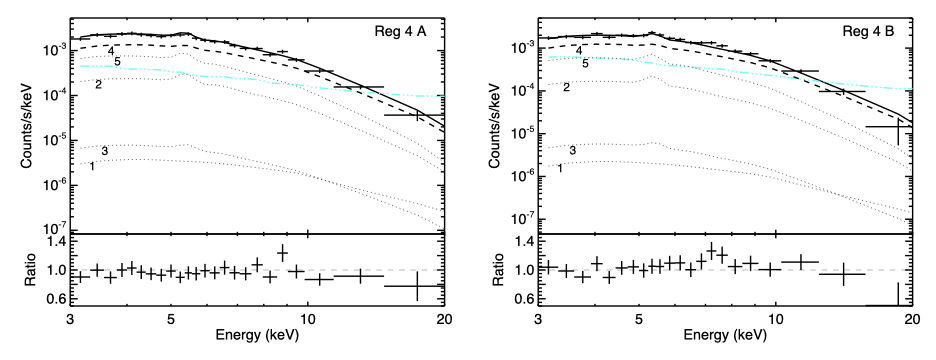

# NuCrossARF

IDL software for the creation of auxiliary response files (ARFs) for any number
of sources, either point-like or diffuse, that properly account for
the scattering of X-rays out of (and into) spectral extraction regions from
*NuSTAR* observations.

### Motivation

As the first focussing X-ray observatory at energies above 10 keV, *NuSTAR*
necessarily has a large (~1' Half Power Diameter, ~18" Full Width at Half
Maximum), slightly energy-dependent point spread function (PSF) that can
scatter photons across the modest 13'x13' field of view (FOV) from even a
single bright source.  Fields with multiple point and/or diffuse sources
will then blur together, and their emission will cross-contaminate each other
in otherwise separate regions centered on the individual sources.  The standard
ARF generation routine, `nuproducts`, can produce ARFs for point or diffuse
sources inside extraction regions, but does not have the capability of
producing ARFs, or cross-ARFs, for other sources of emission outside of
the region from which a spectrum is being extracted.

The suite of routines collected under the software `nucrossarf` both
reproduces the capabilities of `nuproducts` (in that spectral, response
matrix [RMFs], and background [through preceeding use of `nuskybgd`] files
can optionally also be created) and divorces the source distribution from
specific extraction regions, allowing *N* ARFs to be made for *N* regions
from 1 source distribution.  In the common case where *N* regions are
centered on *N* sources, `nucrossarf` will generate *NxN* ARFs to account
for the wings of the PSF of each source present in other regions, otherwise
known as cross-ARFs (although no distinction need be made between "regular"
and "cross" ARFs, as regions do not need to be centered on sources).  Multiple
source models can then be loaded into `XSpec12` or another spectral fitting
package.  Because of the large number of ARFs that can be created for even
a modest number of sources and regions, an `XSpec` script, or `xcm`, file
is also output to load spectra, response files, and source models
self-consistently, ensuring ARFs are loaded and model parameters are tied
together correctly.

### Dependencies and Installation

- An `IDL` distribution: It is unclear if any version of `IDL` is too old,
as no particularly fancy features are employed, but who can say?

- The `astrolib` distribution is heavily used.  Add link.

- This code shares custom routines with `nuskybgd` and related code,
`nuimylze`, which was actually developed first but is still undergoing
testing.  These shared routines should be contained in a separate distribution;
ideally, they will be in the future, but for now all else you need be here.

To install, simply make sure all \*.pro routines from this distribution
is somewhere in your `IDL` path.  Routines will be compiled as they are
needed.

### Description

The software is run as a simple call with 1 input parameter, although
additional keywords may also be supplied, e.g., to overwrite the output
from a previous run.  The call is:

    IDL> nucrossarf,'path/to/dat/file/dir','stem'

Here, it is assumed that IDL is being run from the directory above 'path';
absolute paths also work of course.  Parameters are passed through three
text files:

    path/to/dat/file/dir/stem_obs.dat
    path/to/dat/file/dir/stem_par.dat
    path/to/dat/file/dir/stem_srcs.dat

where 'stem' is user-provided in the call to `nucrossarf`.  The \*\_obs.dat
file lists details of the individual observations, the \*\_par.dat
file contains most parameter settings and region file names, and the
\*\_srcs.dat file lists info on each source distribution.

#### OBS File

This file tells the code where to find the cleaned event file, which is
assumed to be named in the standard way and found inside the directory
`OBSID/event_cl/`.  There is a line in the file for each event file the
data derive from, so a typical single observation would contain 2 lines,
for FPMA and FPMB, both with the same OBSID. The remaining parameters
apply corrections to the astrometry.  For a dataset inside a directory
called `70401000_A2146/`, so the event files are located inside
`70401000_A2146/70401001002/event_cl/`, and the `IDL` session is running
in the above directory, the obs file would look like this:

    70401000_A2146  70401001002  A  -0.25   5.75    0.0    0.0    0.0
    70401000_A2146  70401001002  B   0.00   0.00    0.0    0.0    0.0

The 5 numbers on each line correspond to astrometry shifts in units of
pixels (*NuSTAR*'s pixel scale is 2.46 arcsec/pix).  In this example,
the astrometry of FPMA has been shifted to agree with that of FPMB.  It
is not uncommon for both the relative and absolute astrometry to be off
by 10" or more.  This example does not presume the FPMB astrometry is
correct, just that the source distributions are defined relative to it.
The first 2 numbers are shifts in x and y, respectively; if the A and B
images were aligned, the target in A would be 5.75 pixels to the north (up)
and 0.25 pixels to the east (left) relative to the position of the target
in B.  The last 3 numbers refer to a rotation of the coordinates, which is
occasionally needed on the order of ~1 degree (so it can often be neglected).
The first value is the rotation (in degrees, clockwise wrt the image,
counterclockwise wrt coordinates, so the direction of north rotates toward
the east), and the other 2 numbers are the original x and y pixel values
(in sky coordinates) around which the rotation is done.  The rotation
is applied first, with the shifts in x and y applied after.

In the above background-subtracted and smoothed images, contours from the
FPMB data (right) have been overlaid onto the FPMA image (left) using their
native, uncorrected astrometry; a clear offset is present.
To align their coordinates, the A image should be shifted down with the
astrometry fixed, or equivalently the coordinate system should be shifted
up, the latter of which is the sense of the shifts in the obs file.

Note that shifts and rotations are not applied to the data itself, but
to the placement of extraction regions and source distributions.

#### PAR File

This file sets the output directory and output file stem (`outdir` and
`outbase`, respectively), the location of source distribution images for
extended sources (`extdir`), directory and stem for region file names
and the number of regions (`regbase` and `nreg`, respectively: region
files names must comprise a numerical sequence, so in the example below,
the files would be named `test1.reg`, `test2.reg`, ..., `test5.reg`),
directory and sky area that covers the source distributions (`libdir`
and `libbox`, respectively), and other optional parameters.

    outdir    70401000_A2146/arftest
    extdir    70401000_A2146/ext
    outbase   test
    regbase   70401000_A2146/test
    nreg      5
    libdir    70401000_A2146
    libbox    239.047,66.354,5.7',5.7'
    srcbin    2

Before generating ARFs, a library of point source ARF and PSF `IDL` save
files are created in a grid within the region specified by the 4-value
`libbox` parameter (RA, Dec, box width, box height).  The units of the
width and height values can be in either arcmin (') or arcsec (").
The libraries are gridded every 10 pixels for PSF images (white diamonds
in the below image) and every 4 pixels for ARF arrays (yellow crosses),
which roughly corresponds to the off-axis spacing of the PSF and vignetting
files in the CALDB.  Each PSF (including energy dependence) and ARF are
composites determined by the distribution of off-axis and azimuth angles
relative to the optical axis during the observation, which varies due to
thermal expansion/contraction of the mast due to differential heating as
the spacecraft moves into and out of Earth's shadow in its orbit, and is
thus unique for any particular observation.

The only other parameter shown in the example, `srcbin`, allows for the
binning of the source distribution image for extended sources.  The
default behavior is for the distribution to be evaluated at every pixel
of the source image.  For even modest source extents, such as in this
example, that would require ARFs and PSFs to be centered on over 10,000
pixels assuming the source image matches *NuSTAR*'s pixel scale,
which is not required
(for reference, with an 8-core Intel Core i9 chip on a model
16" 2019 MacBook Pro, the computation for each pixel takes about 1 second,
resulting in a ~4 hour runtime per observation for the largest source
distribution considered here).
By binning the source image, the runtime can be reduced by 1/`srcbin`^2,
albeit with potential loss of accuracy.
In this example, binning by 2 led to fractional differences of <1.5%,
with the largest differences for the ARFs occurring for the smallest
regions (circles of 30" radius, the smallest recommended region size
given the calibration accuracy of *NuSTAR*'s PSF).

All output files (described in detail below) will be placed in `outdir`,
which will be created if it does not exist.  The ARFs themselves will
further be placed into OBSID-named directories to avoid duplicate names
when there is more than one observation or to avoid long filenames.

#### SRCS File

Like the OBS file, this parameter file contains the properties of each
source model, both spatially and spectrally.
Three types of spatial
model are allowed: point source (`pt`), uniform extended emission
(`flat`), and user-supplied source distribution (provided by a pair
of fits image files).
The first 4 values of each line will vary for these cases, while the
remaining values are passed to the `xcm` file to set up the spectral
model in `XSpec`.
The first of those is of the form `modelname:nparams`, where `modelname`
can be any combination of `XSpec` models (this string is just written
to the `xcm` file; no checks on its compliance are done).
The value
of `nparams` should be the *total* number of parameters in the composite
model.  The following entries are the initial values and ranges of each
parameter, which should consist of a comma-delimited string of the form
`value,delta,min,max`.  
To fix or freeze values, set `delta` to a negative
number, and to tie a parameter to another one, set `value` to
`=s{i_s}:p{i_p}`, where `i_s` is the source number of the parameter and
`i_p` is the parameter number in that source.
In the example below, the redshifts of the `APEC` model for the diffuse
sources are tied together through the source 2 value (note that even
if a parameter is frozen or tied, all 4 entries must be given for each
parameter).

    1  pt  239.099   66.3768     po:2 1.8487,0.1,0.0,9.0 3.24e-5,1e-5,0.,10.
    2  src.fits  regions.fits  1 apec:4 8.294,0.1,0.,40. 0.515,0.01,0.,2. 0.257,0.01,0.,2. 2.109e-3,1e-5,0.,1e-2
    3  src.fits  regions.fits  2 apec:4 15.55,0.1,0.,40. 0.1546,0.01,0.,2. =s2:p3,0.01,0.,2. 7.85e-5,1e-6,0.,1e-2
    4  src.fits  regions.fits  3 apec:4 9.0,0.1,0.,40. 0.285,0.01,0.,2. =s2:p3,0.01,0.,2. 1.14e-3,1e-5,0.,1e-2
    5  src.fits  regions.fits  4 apec:4 6.164,0.1,0.,40. 0.18,0.01,0.,2. =s2:p3,0.1,0.,2. 3.24e-3,1e-5,0.,1e-2

The number starting on each line is an integer indicating the source
number.
(I think it's not really used, just the order the models appear in the
file, and if so I will change that so order doesn't matter.)
For point sources, the next 3 entries are just `pt  RA  Dec`, with
`pt` letting the code know to treat it as a point source.
The RA and Dec may not be the *true* absolute position of the source,
but it should correspond to the source position in the native or corrected
WCS coordinates.

For a uniform source distribution, those 3 entries should be
`flat  flat  {regnum}`, where `{regnum}` corresponds to the region
number.
If the third source were replaced with a flat distribution,
the line would read:

    3  flat  flat   3   apec:4 15.55,0.1,0.,40. 0.1546,0.01,0.,2. =s2:p3,0.01,0.,2. 7.85e-5,1e-6,0.,1e-2

Uniform distributions use one of the regions, assuming the source is
uniformly bright within it and not present outside it; in this case,
it will use the region file `70401000_A2146/test/test3.reg`.
For a flat distribution that does not correspond to one of the spectral
extraction regions, do not use the `flat` type but use a fits file
instead.

The most generic source distribution is provided by use-supplied image.
In this example, the same source distribution image,
`70401000_A2146/ext/src.fits`, is used for sources 2-5 with the parts
of the image for each individual source being labeled in
`70401000_A2146/ext/regions.fits`.
These two images, along with a combined A+B background-subtracted
and exposure-corrected 4-25 keV image, used as the starting point for
the creation of `src.fits`, is shown below (left panel).

Abell 2146 is a galaxy cluster undergoing a binary merger between similar
mass subclusters along the SE-NW direction, with one of the subclusters
containing a cool core (inside the circle labeled "2" in the left image),
with gas cooler than the surrounding medium.
The subclusters drive shock fronts in the intracluster medium (approximately
located in the rectangles labeled "3" and "4"), which should therefore be
hotter than the surrounding medium.
As such, the diffuse cluster emission is coarsely divided into 4 regions
(2-5) for spectral extraction (region 5 excludes the other 4 regions shown,
so any given event is included in at most 1 spectrum).
There is also a bright background AGN projected onto the diffuse emission;
50% of its flux is contained within the circle labeled "1".
Even though this AGN is far from most of the action, in principle its
PSF wings will contribute some number of photons to all the other regions.
This contribution is included as source 1 in `\*\_srcs.dat`, and the
first extraction region (`test1.reg`) is centered on it to provide better
constraints on the parameters of that source model.
Although all spectra will constrain that model, the contribution will
generally be small for all regions except region 1.

> **IMPORTANT NOTE**  
> Due to a custom region file interpretation routine, `reg2mask.pro`,
> region shapes can only be of 4 types (although they can be combined
> as include/exclude as usual): `circle`, `ellipse`, `box`, and
> `polygon`.
> The latter can reproduce any region shape, and `panda` class regions
> can also be constructed out of a `circle` include region and a
> combination of `circle` and `box` exclude regions, for example.

To create the diffuse source distribution image, shown in the middle
panel, the left image was smoothed by a 1 pixel Gaussian kernel to reduce
pixel-to-pixel shot noise effects (using `gblur.pro`).
The AGN emission has
also been suppressed, replacing all pixel values inside region 1 with a
count rate comparable to the diffuse emission at that location.
(Ideally this procedure would involve subtracting the PSF of the AGN
to more accurately remove its contribution everywhere.)
Such operations are straightforward in `IDL` with `reg2mask.pro`, e.g.,

    IDL> fits_read,imfile,im,header
    IDL> mask=reg2mask(imfile,regfile)
    IDL> ii=where(mask gt 0.5)
    IDL> im[ii]=newval
    IDL> fits_write,outimfile,im,header

Finally, the right image shows a fits file containing integer values
that indicate which source each pixel in `src.fits` belongs to; in this
and most typical cases, the source regions correspond directly to the
spectral extraction regions, *except* for source region 4.
Unlike `test5.reg`, which excludes data from `test1.reg`, where the
AGN is brightest, source 4 includes this area because there is also
diffuse emission present here.
One could instead simply add an `APEC` model to source 1, but then the
emission would be treated incorrectly (as a point source).
Alternatively, another diffuse source could be added for `test1.reg`,
which would be identical to this method if all model parameters were
tied to those of source region 4.
While equivalent, this method is more elegant, leading to less
jury-rigging in `XSpec`.
To connect the pixel values in `regions.fits` with the source in the
\*\_srcs.dat file, the 4th entry in the line for a source tells the
code which pixels in `regions.fits`, and thus in `src.fits`, it belongs to.
Images like `regions.fits` can be easily made in `IDL` via the above
code (`reg2mask.pro` outputs the indices of a 2D image with 1s for all
pixels inside the region and 0s for all pixels not in the region).

#### Running the Code

As you probably noticed from the above, certain file name conventions
are enforced, which currently extends to `pha`, `bgd`, and `rmf` filenames
as well, whether they are created separately in `nuproducts` or by
`nucrossarf`.
In the latter case, the files will be created with the correct filenames.
These filenames in the current example are:

    70401000_A2146/arftest/70401001002/testA1.pha
    70401000_A2146/arftest/70401001002/bgdtestA1.pha
    70401000_A2146/arftest/70401001002/testA1.rmf
    ...

Any files with the correct names that already exist in the indicated
output directory will not be overwritten unless the corresponding
'clobber' keyword is set: `clobspec`, `clobbgd`, `clobrmf`, `clobarf`.
To make `pha`, `bgd`, and `rmf` files as well as ARFs, you need to add
the line `mkspec    1` to the \*\_par.dat file (the '1' can also be
set to 'y' or 'yes').

If applying astrometry corrections, you may want to check that the
updated astrometry has been correctly corrected and not applied in
the opposite sense from that intended.
To do so, add `/checkast` to the `nucrossarf` call; the code will be
run far enough to apply corrections and write an output image with the
updated astrometry
(`checkast` can also be set to an output directory if desired).
This step is highly recommended as the sense of astrometry corrections
in the \*\_obs.dat files can be easily confused.

Now, at long last, you are ready to run the routine!
When you do, spec/bgd/rmf files will be created first (if `mkspec` is set),
and the then PSF and ARF libraries will be created inside the
`{libdir}/psf/` and `{libdir}/arf/` directories.
A progress indicator will be printed to the screen; the length of this
step will depend on the size of `{libbox}`.
Note that subsequent calls will not recreate existing files, say if
`{libbox}` is expanded; only files not already existing will be created.

Once library files are made, the ARFs themselves will be generated.
For diffuse sources, a plot window should pop open to display the progress
of the calculation, with the source region shown in red inside an outline
of the FOV (below left; this example is for source 5 with a source image
binning equal to *NuSTAR*'s pixel scale).
Each pixel of the source image is multiplied by the PSF at that location,
which is used to scale the ARF of that source inside each spectral extraction
region, including the energy dependence of the PSF, which is larger at lower
energies.
Pixels become green where the PSF has been computed.
The ARFs for all extraction regions are written for that source at completion,
and the code will move on to the next source distribution.

The four panels on the right side of the above image show fits images that
are also written to the output directory to allow the user to check that the
source was treated reasonably (here, they are named
`testA_psfim_src1_reg1.fits`, etc.)
In this example, the calculation for the point source, source 1, is shown for
4 of the 5 spectral extraction regions.
Each panel has the same logarithmic intensity scale.
(The images show the photon distribution in the 3-4.5 keV energy band only;
the other PSF bands are not saved.)
If something went wrong with either a source or extraction region, these
images should reveal the problem.

Finally, the routine ends and writes an `xcm` file to the output directory.
All files to be loaded are written with their directories such that,
when supplying relative directories, the script should be able to find
all data and response files if they are properly named when `XSpec` is
run from the same directory `IDL` was started in.  In this example, if
one exited `IDL` and started up `XSpec` from the same terminal, they could
load the script with:

    XSPEC12> @70401000_A2146/arftest/test.xcm

The parameter numbers of the constant terms for each observation are also
written at the end of the `IDL` routine, which in this case is:

    XCM file:
      Obs 1 cross-calibration constant is s1:3
      Obs 2 cross-calibration constant is s1:18

One of these parameters should always be left fixed to 1, but the others
(in this case `s1:18` for the cross-calibration constant of FPMB spectra)
can be thawed to account for few percent discrepancies between telescopes,
which are not uncommon.

After one call to `XSpec`'s `fit` command, a good fit is obtained without
thawing B's cross-calibration constant.

    Fit statistic  : C-Statistic                  148.41     using 188 bins.
                     C-Statistic                  326.57     using 321 bins.
                     C-Statistic                  347.83     using 315 bins.
                     C-Statistic                  309.35     using 319 bins.
                     C-Statistic                  442.25     using 473 bins.
                     C-Statistic                  156.74     using 195 bins.
                     C-Statistic                  394.71     using 317 bins.
                     C-Statistic                  303.62     using 318 bins.
                     C-Statistic                  326.01     using 333 bins.
                     C-Statistic                  493.57     using 472 bins.
    Total fit statistic                          3249.07     with 3236 d.o.f.

Although most spectra have C-stat values comparable to the number of their
bins, spectrum 7's fit (unfortunately, yellow in the plot) seems considerably
worse, although not obviously in a systematic way.
Because the plot is such a jumble (not only are there 10 spectra loaded, but
the 5 source model contributions to *each* spectrum is also shown, littering
the plot with a rainbow of jagged lines), the plot information was saved to
a text file so that the spectra could be examined individually (a version
of this routine may be included in a future release).

To more clearly see the quality of the fits to each spectrum, they have been
separated in the below plots with the contribution from each source shown
and labeled (1-5).
The source model originating inside the region the spectrum was extracted
from is shown as the dotted thick line, and the
cyan line indicates the background level.
The total model is the solid thick line, and the ratio of the data to that
is shown in the "Ratio" pane of each plot.

Overall, the relative contributions of each source make sense, generally
dominated by the source corresponding to that region, although in many cases
other sources are significant contributors.
In extraction region 1 (top plots), source 5 dominates at low energies and
source 1 (the AGN point source model) only dominates at the highest energies.
This situation is sensible given that the point source is weak, but
should have a harder non-thermal spectrum, and that
source 5, which exists both inside and surrounds region 1, thus additionally
scatters extra emission into it.
However, the relative contribution of emission from source 1 to region 5,
is small, even though there is comparable emission in region 5 from source 1
as there is from source 1 into region 1
(as can be seen by that model's normalization in both top [Reg 1] and bottom
[Reg 5] panels).

It should be noted that the best-fit parameter values are physically
sensible as well, with the power law index of the point source consistent
with that of AGN, hotter temperatures in the shock regions, and cooler
temperatures in the cool core and broader diffuse medium regions.
The poorest C-stat value corresponds to the Reg 2 B spectrum, which does
show more variance in its ratio plot, but no systematic trend, suggesting
the deviation may simply be random.

### Validation on Extragalactic Point Sources
